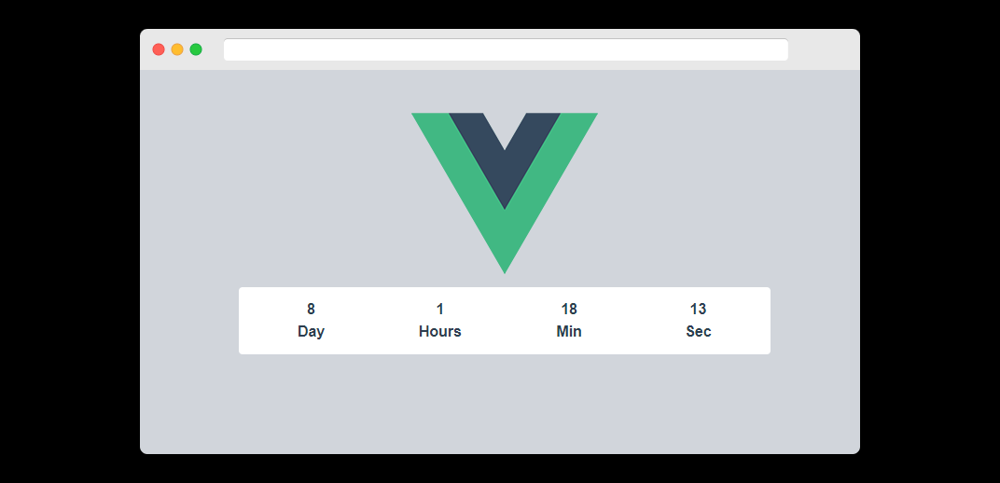

# countdown
this is first basic project to do kick start vue js expert road map. In this project we will create a countdow timer with component and include it in our main App.vue file.



## Project setup
```
npm install
```

### Compiles and hot-reloads for development
```
npm run serve
```

### Compiles and minifies for production
```
npm run build
```


# Hi, I'm Amit Mandaviya! 👋


## 🚀 About Me
I'm a Laravel developer and working on vue js example and demos to become a full stack developer.


## Author

- [@amitm13](https://www.github.com/amitm13)

